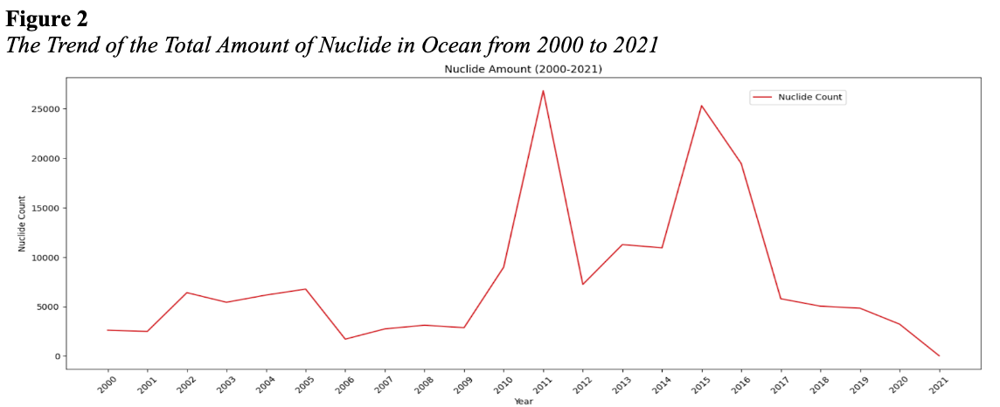
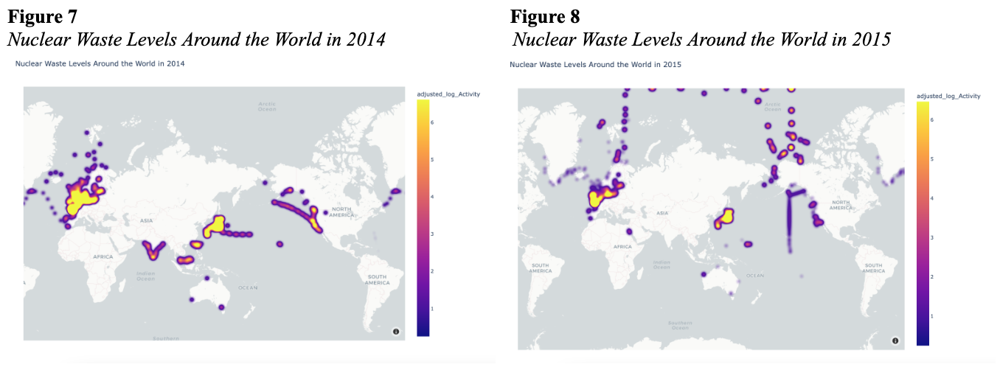
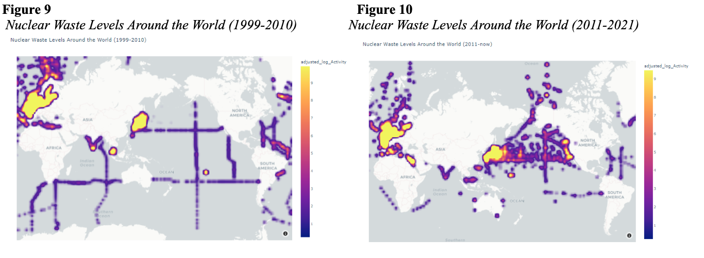

# Marine Radioactivity Assessment Using Advanced Data Analytics Techniques

### Project Description
Conducted comprehensive data analysis on the MARIS database, utilizing advanced analytics to assess marine radioactivity across over 275,000 data points and 54 metrics, identifying key trends and hidden patterns relevant to nuclear waste management. Leveraged sophisticated data analytics techniques to reveal intricate relationships between nuclear waste levels and plant locations, enhancing understanding of nuclear activity variances and informing stakeholder decision-making in nuclear research.

### Data Source
https://maris.iaea.org/

### Programming Languages & Libraries
* Python
* Pandas
* Numpy
* Plotly

### Key Findings

Figure 2 represents the trend of total number of observations for nuclides in the ocean from 2000 to 2021. There are two peaks in the trend, one in 2011, which matches and implies the nuclear disaster in Japan in 2011 as expected, while the other peak in 2015 is abnormally apparent since no media talked about any high amount of nuclear waste in 2015 around the world.

Figure 7 represents the nuclear waste level in 2014, while Figure 8 represents the nuclear waste level in 2015. The nuclear waste surrounded Western Europe, East Asia, and the West Coast of North America in 2014, and then a year later, in 2015, there were some nuclear waste spotted in the Arctic Ocean. This may be explained by a couple of factors, such as the possibility that waste from these regions has traveled to the Arctic Ocean throughout the year or accidents and nuclear disposal near the Arctic could have caused this.

Figure 9 and Figure 10 present the progression of nuclear waste levels around the world over two distinct decades: 1999-2010 and 2011-2021. The evident yellow markings, indicating higher nuclear waste levels, appear to have intensified in specific regions over the years. The first decade, 1999-2010, illustrates pronounced waste concentrations primarily in parts of Western Europe, East Asia, and the West Coast of North America. However, in the second decade, 2011-2021, there was an escalation in nuclear waste concentrations in these areas, with additional prominent regions emerging. Specifically, a noticeable spread is evident across the Eurasian landmass, the northern parts of the Atlantic Ocean, and the Pacific Ocean area between East Asia and the West Coast of North America. Such a trend suggests increased nuclear activities or waste disposal mechanisms in these regions. The proliferation in the latter decade might indicate changes or persisting issues in international policies or practices, leading to the accumulation of nuclear waste in these new areas. Evaluating such trends is vital for understanding the global impact of nuclear waste management and for formulating strategies to address environmental concerns. 
